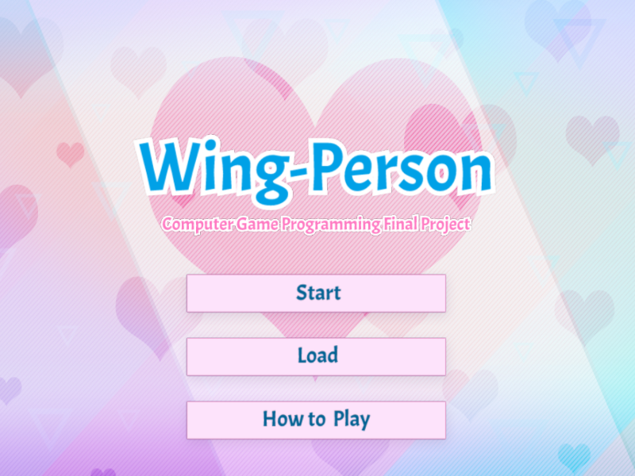
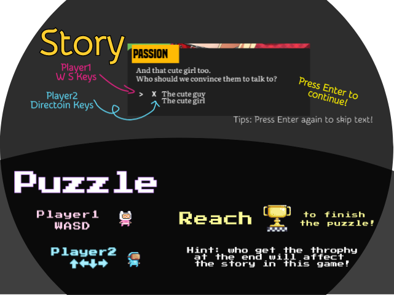

# Wingperson

Authors: Fengying Yang, Tyler Thompson, Pavan Paravasthu, and Jonathan Yan

Design: This game's core theme is co-op dating sim puzzle game. To that we end, we created a dating sim with two Guardian Dating Angels each controlled by a player who must work together to get the main character of the story a date by making decisions through cooperative puzzles.

Screen Shot:

How To Play:

Sources:

- Tile editing tool: Tiled Editor (https://www.mapeditor.org/)
- Virtual novel characters: http://www.jewel-s.jp/download/, https://sutemo.itch.io/female-character, https://sutemo.itch.io/male-character-sprite-for-visual-novel
- Virtual novel background: https://konett.itch.io/modern-visual-novel-backgrounds
- Set of 3 wings: https://www.vecteezy.com/vector-art/302320-three-set-of-black-wings
- Platformer: https://pixelfrog-store.itch.io/pixel-adventure-1, https://pixelfrog-store.itch.io/pixel-adventure-2
- UI: https://loudeyes.itch.io/dating-sim-ui-pack
- Fonts: https://www.dafont.com/built-titling.font, https://www.fontspace.com/literata-font-f32719, https://fonts.google.com/featured/Plex, https://cm-unicode.sourceforge.io/
- Music by W.O.W Sound [https://wowsound.com.sg]
- SFX by W.O.W Sound [https://wowsound.com.sg]
- Puzzle SFX by Hanna-Barbera SoundFX Library [https://www.sound-ideas.com/Product/409/hanna-barbera-sound-effects-library/] 

This game was built with [NEST](NEST.md).
